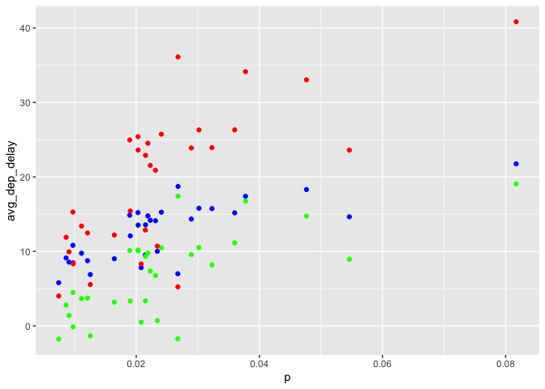

hw1
================
2022-09-22

``` r
library(dplyr)
```

    ## Warning: package 'dplyr' was built under R version 4.0.5

    ## 
    ## Attaching package: 'dplyr'

    ## The following objects are masked from 'package:stats':
    ## 
    ##     filter, lag

    ## The following objects are masked from 'package:base':
    ## 
    ##     intersect, setdiff, setequal, union

``` r
library(nycflights13)
library(ggplot2)
library(tidyr)
```

    ## Warning: package 'tidyr' was built under R version 4.0.5

``` r
flights
```

    ## # A tibble: 336,776 × 19
    ##     year month   day dep_time sched_dep_time dep_delay arr_time sched_arr_time
    ##    <int> <int> <int>    <int>          <int>     <dbl>    <int>          <int>
    ##  1  2013     1     1      517            515         2      830            819
    ##  2  2013     1     1      533            529         4      850            830
    ##  3  2013     1     1      542            540         2      923            850
    ##  4  2013     1     1      544            545        -1     1004           1022
    ##  5  2013     1     1      554            600        -6      812            837
    ##  6  2013     1     1      554            558        -4      740            728
    ##  7  2013     1     1      555            600        -5      913            854
    ##  8  2013     1     1      557            600        -3      709            723
    ##  9  2013     1     1      557            600        -3      838            846
    ## 10  2013     1     1      558            600        -2      753            745
    ## # … with 336,766 more rows, and 11 more variables: arr_delay <dbl>,
    ## #   carrier <chr>, flight <int>, tailnum <chr>, origin <chr>, dest <chr>,
    ## #   air_time <dbl>, distance <dbl>, hour <dbl>, minute <dbl>, time_hour <dttm>

``` r
f1 = flights %>% 
  mutate(a = 0)
```

``` r
#Q1

#(a)
sum(is.na(flights$dep_time))
```

    ## [1] 8255

``` r
#There are 8255 flights have a missing dep_time

#(b)
miss = function(df){
  reps = rep(NA, ncol(df))
  for (x in 1:ncol(df)){
    
    if  (sum(is.na(flights[,x])) != 0) {reps[x] = colnames(df)[x]}
  
    
  }
  
  return(reps)
}


miss(flights)
```

    ##  [1] NA          NA          NA          "dep_time"  NA          "dep_delay"
    ##  [7] "arr_time"  NA          "arr_delay" NA          NA          "tailnum"  
    ## [13] NA          NA          "air_time"  NA          NA          NA         
    ## [19] NA

``` r
#dep_time, dep_delay, arr_time, arr_delay, tailnum, air_time have missing values 


# The rows mean the flight information of each flight
```

``` r
#Q2
f2 = flights %>% 
  mutate(new_dep = 60*(dep_time%/%100) + dep_time%%100) %>% 
  mutate(new_sche_dep =  60*(sched_dep_time%/%100) + sched_dep_time%%100)
```

``` r
#Q3

a= flights %>% 
  group_by(day) %>% 
  summarise(p = sum(is.na(dep_time)/n()))

b= flights %>% 
  group_by(day) %>% 
  summarise(avg_dep_delay = mean(dep_delay, na.rm = T),
            avg_arr_delay = mean(arr_delay, na.rm= T),
            total_delay = avg_dep_delay + avg_arr_delay)

c = left_join(a, b)
```

    ## Joining, by = "day"

``` r
ggplot(data = c, aes(x = p)) +
  geom_point(aes(y = avg_dep_delay), color = "blue") + 
  geom_point(aes(y = avg_arr_delay), color = "green") +
  geom_point(aes(y = total_delay), color = "red")
```

<!-- -->
